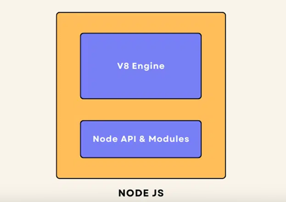
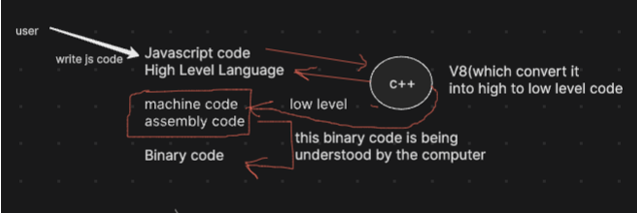

# JS on Server

## NodeJS

### What is a server?

- Server is a computer or system that provides resources, data, services or programs to other computers, known as clients, over a network.
- Basically servers are Desktops/Laptops with higher physical configuration, Example...
  - Higher RAM (64 Gigs, 128 Gigs, e.t.c.,)
  - Redundant Power supply
  - Redundant Network Cards
- Based on their functions servers can be broadly categorized into the following
  - Web Server
  - Mail Server
  - Print Server
  - File Server e.t.c.,

### What is a Web Server?

- A web server is a combination of hardware and software that uses protocols like Hypertext Transfer Protocol (HTTP) to respond to requests from clients on the World Wide Web.

### What is IP address?

- An IP address, or Internet Protocol address, is a unique number that identifies
  every device connected to the internet

### What is a Javascript engine?

- A Javascript engine is a program that executes Javascript code.
- It takes human-readable Javascript code and translates it into machine-readable instructions and execute
- Some key functions of a Javascript Engine are...
  - **Parsing**
    - The engine reads the Javascript code and checks its syntax.
    - It then creates a data strcuture called an Abstract Syntax Tree (AST) representing the code's structure
  - **Compiling**
    - Modern Javascript engines use Just-In-time (JIT) compilation to convert the AST into machine code.
  - **Execution**
    - The engine runs the compiled machine code.
- Popular Javascript engines
  | Engine | Developed By | Uses in |
  | ------ | ------------ | ------- |
  | [V8](https://v8.dev/docs) | Google | Chrome, Node.js |
  | [SpiderMonkey](https://spidermonkey.dev/) | Mozilla | Firefox |
  | JavascriptCore/JSC/Nitro | Apple | Safari |
  | Chakra | Microsoft | Edge |

### What is v8 ?

- The V8 JavaScript engine is written in C++
- V8 can be embedded into any C++ program, which is a crucial feature.
- The process works as follows: JavaScript code is executed by V8 (written in C++), which then compiles it down to machine code that the computer can execute.

### How NodeJS enabled Javascript to run not only on browser?

- Node.js & V8 engine are developed using C++
- So whatever the nodes that can support C++ can now support Node.js as well.

### Why Node.js is required when V8 alone can compile and execute javascript?

- V8 is just the engine, like the engine in a car. Node.js is the entire car, providing features like...
  - File System access
  - Network communication e.t.c.,
- Also Node.js provides APIs and Modules (e.g., fs, http) that enable you to interact with the operating system and perform various tasks.

## 🤔 how JavaScript code comes to life?

- We write JS, and then the V8 engine translates it into machine and assembly code—also known as lowlevel code—so the machine can understand it. It's amazing how our high-level scripts transform into the instructions that power our apps!
- Low-level code refers to programming languages or code that is closer to machine language and hardware. It provides little abstraction from the computer's architecture and allows for fine-grained control over system resources. Here are some key points about low-level code:
- Machine Language: The most basic form of low-level code, consisting of binary (0s and 1s) instructions that the computer's CPU can directly execute.
- Assembly Language: A step above machine language, assembly language uses symbolic representations (mnemonics) for operations and memory addresses, making it somewhat easier for humans to read and write. Each assembly instruction corresponds to a specific machine language instruction.
