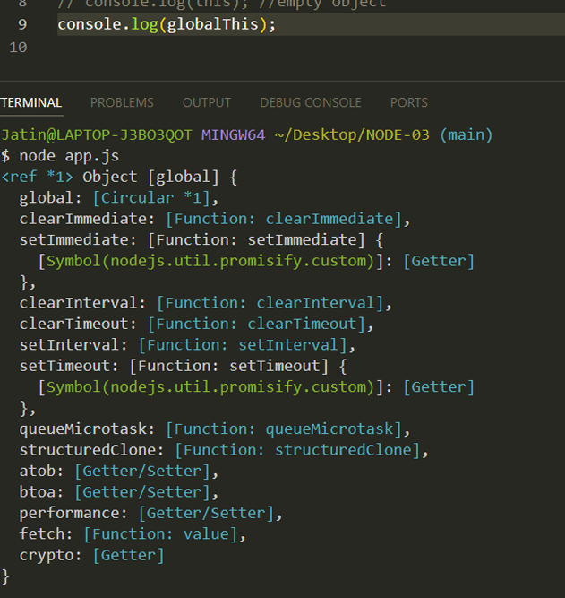

# Lets Write Code

1. Download & install NodeJS into your system
1. Open cmd and write node
1. Now we can run any JS in CMD
1. we can Run JS into console also
1. Create app.js file in VSCode to write JS Program

```javascript
var name = 'Sameer';
var a = 10;
var b = 20;
console.log(name);
console.log(a + b);
```

### Terminal

node app.js <--- CMD to Run JS

Sameer
30

## Let's talk about global objects in NodeJS

- This window Object is a global object provided by the browser, not by the **V8 engine**.
- Now , In NodeJS, the global object is known as global, which is equivalent to the window object in the browser.
- A global object is not a part of the V8 engine; instead, itʼs a feature provided by Node.js
- This global object offers various functionalities, such as setInterval() , setTimeout() and more.

### Global this

is always a global object, regardless of where it is accessed. It was introduced in ECMAScript 2020 to provide a standardized way to refer to the global object in any environment (browsers, Node.js, etc.).

- In browsers, global is equivalent to window .
- In Node.js, globalThis is equivalent to global .
- It provides a consistent way to access the global object without worrying about the environment.


