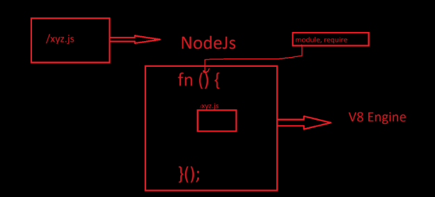
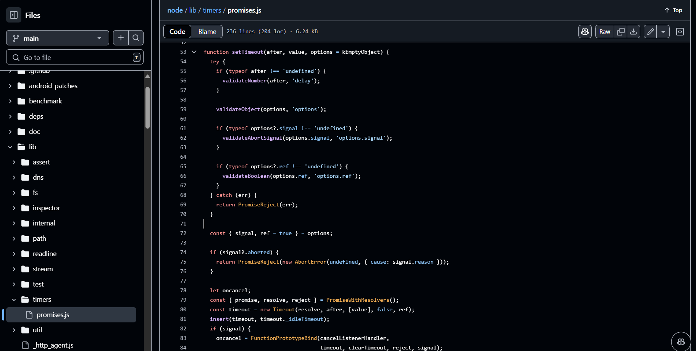

# Diving into the NodeJS GitHub repo

In this episode, we'll explore how modules actually work behind the scenes. We'll dive into how modules load into a page and how Node.js handles multiple modules, focusing on a deep dive into the _module.exports_ and _require_ functions

## Behind the Scenes

In JS, When You create a function....

```javascript
function (){
    const a = 10;
    function b(){
        console.log("b");
    }
}

console.log(a);

// op- a is not defined
```

## Q: if u execute this code, will you be able to access it outside the function?

A: You cannot access `a` value outside the function `x` because it is defined within the function's scope. Each Function create its own scope, so variables inside a function are not accessible form outside that function.

- **Imp Concept**
- `Modules in Node.js work similarly to function scopes. When you required a file, Node.JS warps the code from that file inside a function. This means that all variable and functions in the module are contained within that function's scope and cannot be accessed from outside the module unless explicitly exported.`
- `To expose variables or functions to other modules, you use module.exports. This allows you to export specific elements from the module, making them accessible when required elsewhere in your appliction.`
- `All the code of a module is wrapped inside a function when you call require. This function is not a regular function; it's special type know as an IIFE(Immediately Invoked Function Expression). Here's how it works: `

```javascript
(function () {
  // All the cide of the module runs inside here
})();
```

In this pattern, You create a function and then immediately invoke it. This is different from a normal function in JavaScript, which is defined and then called separatly:

```javascript
function x() {}
x();
```

#### In Node.js, before passing the code to the V8 engine, it wraps the module code inside an IIFE. The purpose of the IIFE is to:

1. **Immediately Invoke Code:** The Function runs as soon as it is defined.
1. **Keep Variable and Functions Private:** By encapsulating the code within the IIFE, it privates variable and functions from interfering with other parts of the code. This ensures that the code within the IIFE remains independent and private.

Using IIFE sloves multiple problems by providing scope isolation and immediate execution.

_very imp:_

## Q: How are variables and functions private in different modules?

A:

Because of IIFE and the requiement (statement) wrapping code inside IIFE.

## Q: How do you get access to module.export? Where does this module come from?

A:

In Node.js, when you code is wrapped inside a function, this function has a parameter named _module_.This paraeter is an object is an object provided by the Node.js that includes _module.exports_.


When you use _module.exports_, you're modifying the _exports_ object of the current module. Node.js relies on this object to determine what will be exported from the module when it's required in another file.

The _module_ object is automatically provided by Node.js and is passed as a parameter to the function that wraps your code. This mechanism allows you to define which parts of your module are accessible externally


Summary



## Q: How require() Works Behind the Scenes

1. **Resolving the Module**

- Node.js first determines the path of the module. It checks whether the path is a local file(_./local_), a JSON file (_.json_),or a module from the _node modules_ directory, among other possibilities.

2. **Loading the Module**

- Once the path is resolved, Node.JS loads the file content based on its type. The loading process varies depending on whether the file is JavaScript,JSON or another type.

3. **Wrapping Inside an IIFE**

- The module code is wrapped in an immediately Invoked Function Expression(IIFE). This Wrapping helps encapsulate the module's scope keeping variables and functions private to the module.

4. **Code Evaluation and Module Exports**

- After wrapping, Node.js evaluates the module's code. During this evaluation, module.exports is set to export the module's functionality or data. This step essentially makes the module's exports avaiable to other files.

5. **Caching(Very Imp)**

- **Importance:** Caching is crucial for perdormance. Node.js caches the result of the _require()_ call so that the module is only loaded and executed once.

---

- **Scenario**: Suppose you have three files: _sum.js_ , _app.js_ ,and _multiply.js_ three files require a common module named _xyz_ .

- **Initial Require:**

  - When _sum.js_ first requires _xyz_ with _require('./xyz')_, Node.js performs the full _require()_ process for _xyz_ :

  1. **Resolving** the path to _xyz_ .
  1. **Loading** the content of _xyz_ .
  1. **Wrapping** the code in an IIFE.
  1. **Evaluating** the code and setting module.exports
  1. **Caching** is the result.

- Node.js creates a cached entry for _xyz_ that includes the evaluated module exports

### Subsequent Requires:

- When _app.js_ and _multiply.js_ later require _xyz_ using _require('./xyz')_, Node.js skips the initial loading and evalution steps. Instead, it retrieves the module from the cache.
- This means that for _app.js_ and _multiply.js_, Node.js just returns the cached module.exports without going through the resolution, loading, and wrapping steps again.


### Impact on Performance

- If caching did not exist, each _require('./xyz')_ call would repeat the full module loading and evaluation process. This would result in a performance overhead, especially if _xyz_ is a large or complex module and is required by many files.
- With caching, Node.js efficiently reuses the moduleʼs loaded and evaluated code, significantly speeding up module resolution and reducing overhead


---

Welcome back! Now, I will go to the Node.js GitHub repo to show you what's happening.

https://github.com/nodejs

---

1. **NodeJs is open-source Project**
1. **I will now show you how the V8 JavaScript engine is integrated within the Node.js GitHub repo to illustrate its role and interaction with Node.JS.**


3. **When i say there are superpoers, what are this superpowers? This is all the code for the superpowers**


4. **Libuv** is the most amazing superpower

- **Node.js is popular just because of libuv**
- **libuv plays a critical role un enabling Node.js's high performance and scalability. It provides the underlying infrastucture for asynchronous I/O, event handling, and cross-platform compatibility.**

## Q: Where is setTimeout coming from and how it work behind scenes?

https://github.com/nodejs/node/blob/main/lib/timers/promises.js



## require in nodejs repo

In helper.js file, you can find the actual implementation of require method Here is where the required function is formed

go to this path node/lib/internal/modules/helpers.js

https://github.com/nodejs/node/blob/main/lib/internal/modules/helpers.js


the _makeRequireFunction_ creates a custom _require_ function for a given module _mod_.

This function:

- **Validates** that _mod_ is an instance of _Module_ .
- **Defines** a _require_ function that uses _mod.require()_ to load modules.
- **Implements** a _resolve_ method for resolving module paths using _Module.\_resolveFilename()_ .
- **Implements** a _paths_ method for finding module lookup paths using _Module.\_resolveLookupPaths()_.
- Sets additional properties on the _require_ function, such as _main_ ,_extensions_ and _cache_.


## LazyModule()

https://github.com/nodejs/node/blob/main/lib/internal/modules/cjs/loader.js


- If the _id_ argument provided to the _require()_ function is empty or undefined, Node.js will throw an exception. This is because the _require()_ function expects a string representing the path or identifier of the module to load. When it receives _undefined_ instead, it results in a _TypeError_ , indicating that an invalid argument value was provided.
- **Node.js documentation** and **GitHub repository provide** insights into how _require()_ handles module loading. Reviewing these resources can help you understand how to properly use _require()_ and handle potential errors.
