# Libuv & async IO

I hope you remember that in the first episode, we read through the Node.js Wikipedia page. One of the key points we came across was the statement that **"Node.js has an event-driven architecture capable of asynchronous I/O.ˮ**

So, this episode is focused on explaining that concept.

## Q: What is Thread?

**A thread is the smallest unit of execution within a process in an operating system. It represents a single sequence of instructions that can be managed independently by a scheduler. Multiple threads can exist within a single process, sharing the same memory space but executing independently. This allows for parallel execution of tasks with a program, improving efficiency and responsiveness.**

**Threads can be either:**

**1) Single-threaded**

**2) Multi-threaded**

## Q: What type of threading does JS use ?

- JS is a synchrous, single-threaded language, meaning there is only one thread in which the JS engine (such as the V8 engine) runs. In JS, code is executed line by line within this single thread.
- In other language like C++ or Java, code can be executed across multiple threads. For example, a portion of the code might be executed in one thread, while another part runs simultaneously in a different thread. However, JS handles this process more stright forwardly - executing code one line after the other in sequence.
- So, if you're executing line 2 in JS, int will only run after line 1 has finished executing. This is the essence of synchronous execution: each task is performed one after the other, without overlap.

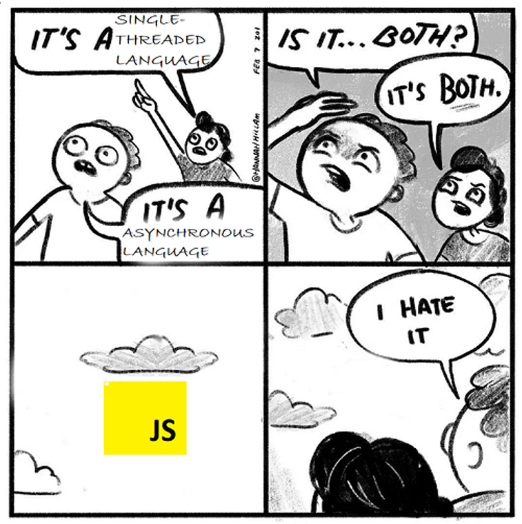

## What is a Synchronous System?

A synchronous system is one where operations are performed sequentially, one after another. Each operation must complete before the next one begins. Think of it like a line of people waiting at a single ATM machine:

**Example: ATM Transaction (Synchronous Process)**

1. Person A is at the ATM performing their transaction
2. Person B must wait until Person A is completely finished
3. Person C must wait for both Person A and B to finish
4. If Person A's transaction takes 5 minutes, everyone else in line is blocked for that duration

## What is a Asynchronous System?

An asynchronous system allows multiple operations to be processed simultaneously without blocking the main program execution. Unlike synchronous systems, tasks can be initiated now and completed later, while other code continues to execute.

Let's understand this with a real-world example: **A Coffee Shop Ordering System**

### Coffee Shop Example:

In a coffee shop:

1. Cashier takes multiple orders simultaneously
2. Baristas prepare different drinks in parallel
3. Customers can place orders without waiting for previous orders to complete
4. When a drink is ready, the customer's name is called

Here's how this works in code:

```javascript
// Simulate an asynchronous Coffee Shop

// Function to simulate preparing coffee (asynchronous operation)
const prepareCoffee = (customerName, coffeeType) => {
  return new Promise((resolve) => {
    console.log(`Started preparing ${coffeeType} for ${customerName}...`);
    // Simulate preparation time with a timeout
    setTimeout(() => {
      resolve(`${coffeeType} for ${customerName} is ready!`);
    }, Math.random() * 3000 + 2000); // Random delay between 2-5 seconds
  });
};

// Function to handle customer orders
const takeOrder = async (customerName, coffeeType) => {
  console.log(`Order received: ${coffeeType} for ${customerName}`);
  const result = await prepareCoffee(customerName, coffeeType);
  console.log(result);
};

// Simulating multiple customer orders
console.log('Coffee shop is open!');

takeOrder('Alice', 'Latte');
takeOrder('Bob', 'Cappuccino');
takeOrder('Charlie', 'Espresso');

console.log('Orders are being processed...');
```

### Explation:

#### Code Flow:

1. **Order Received**: The `takeOrder` function takes a customer name and coffee type.
1. **Prepare Coffee**: The `prepareCoffee` function uses `setTimeout` to simulate a delay in coffee preparation. This is wrapped in a `Promise` to handle asynchronous behavior.
1. **Non-Blocking Execution**: Orders are processed in parallel, and the results are logged independently when each preparation completes.

### Output Example:

The order of the output may vary due to asynchronous execution:

```bash
Coffee shop is open!
Order received: Latte for Alice
Order received: Cappuccino for Bob
Order received: Espresso for Charlie
Orders are being processed...
Started preparing Latte for Alice...
Started preparing Cappuccino for Bob...
Started preparing Espresso for Charlie...
Espresso for Charlie is ready!
Latte for Alice is ready!
Cappuccino for Bob is ready!
```

**So, JavaScript itself is synchronous, but with the power of Node.js, it can handle asynchronous operations, allowing JavaScript to perform multiple tasks concurrently**

## What are the portions inside the JS engine and how synchronous code is executed by JS Engine?

- The JS engine operates with a single **Call Stack**, and the code you write is executed within this **Call Stack**. The engine runs on a **Single Thread**, meaning it can only perform one operation at a time.
- In addition to the call stack, the JS engine also includes a **memory heap**. This memory heap stores all the variables, numbers, and functions that your code uses.
- One key feature of the JavaScript V8 engine is its garbage collector. The **garbage collector** automatically identifies and removes variables that are no longer in use, freeing up memory. Unlike languages like C++, where developers need to manually allocate and deallocate memory, JavaScript handles this process automatically. This means you don't have to worry about memory management—it's all taken care of by the engine.

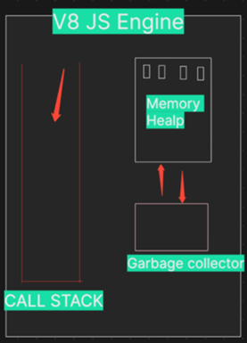

## The CODE execution journey

```javascript
Let a = 10786;
Let b = 20987;

function multiplyFn(x,y){
const result = a*b;
return result;
}

Let c = multiplyFn(a,b);
```

**STEP 1: Global Execution Context Creation**:

As soon as the JS engine begins executing the code, it creates a **Global Execution Context**. This is the main environment where the top-level is executed. The global execution context is unique and is always the first to pushed onto the **Call Stack**.

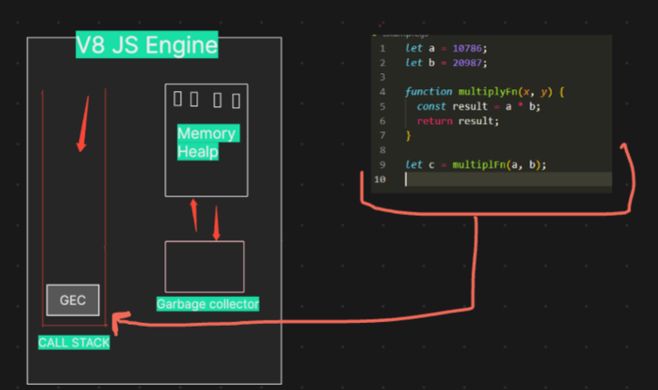

**STEP 2: Memory Creation Phase**:

Before any code is executed, the JavaScript engine enters the **memory creation phase**. During this phase:

- Variables `a` and `b` are declared in memory and initialized to `undefined`.
- The function `multiplyFn` is also stored in memory, with its value set to the entire function definition.

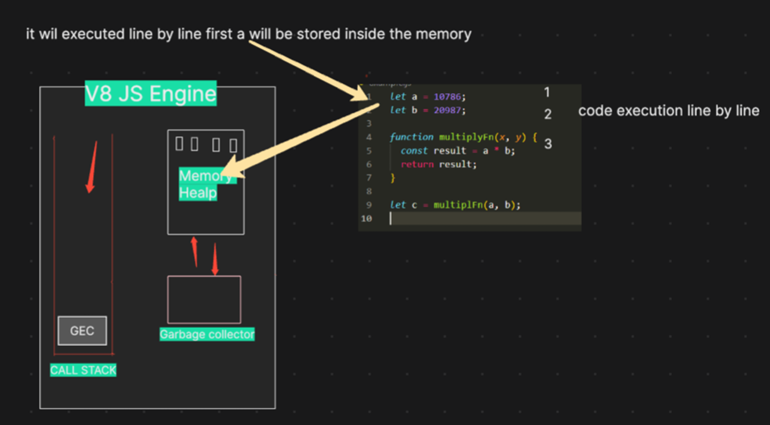

**STEP 3: Code Execution Phase**:

Once the memory creation phase is complete, the engine moves to the **code execution phase**:

- Execution of let `a = 10786;` and let `b = 20987;`: The variables `a` and `b` are now assigned their respective values
- Execution of let `c = multiplyFn(a, b);`: The function `multiplyFn` is invoked, creating a new execution context specifically for this function.

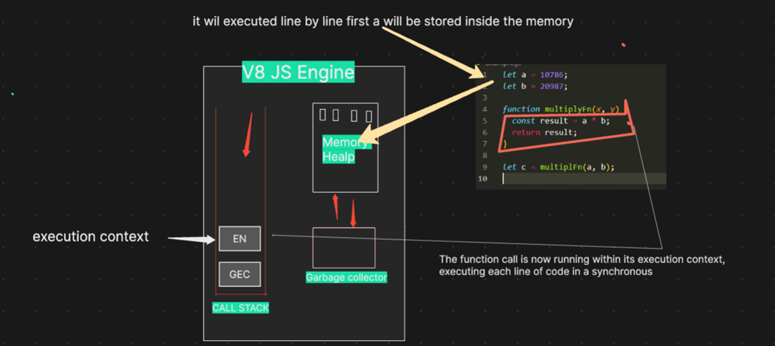

**STEP 4: Function Execution Context Creation**:

When multiplyFn(a, b) is called, the JavaScript engine:

- Creates a new **execution context** for `multiplyFn` and pushes it onto the top of the call stack.
- In this new context, the parameters `x` and `y` are assigned the values of `a` and `b`.

**Step 5: Memory Creation and Code Execution Inside `multiplyFn`**:

Inside `multiplyFn`, the memory creation phase initializes `result` in memory with `undefined`.

- Execution of `const result = a * b;`: The multiplication is performed, and `result` is assigned the value `226215682`.

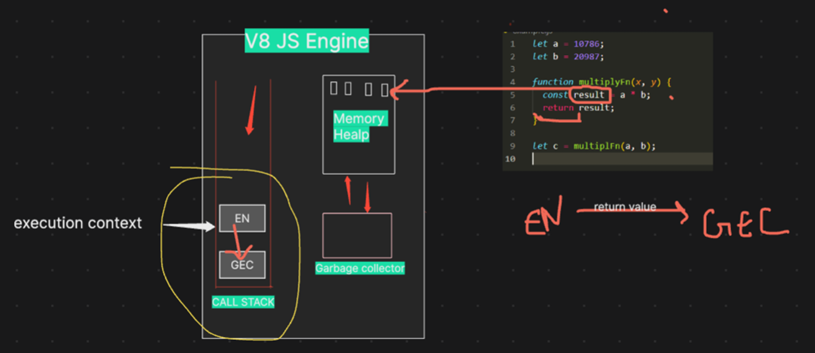

- Execution of `return result;`: The function returns `226215682`, and the `multiplyFn` execution context is popped off the call stack
  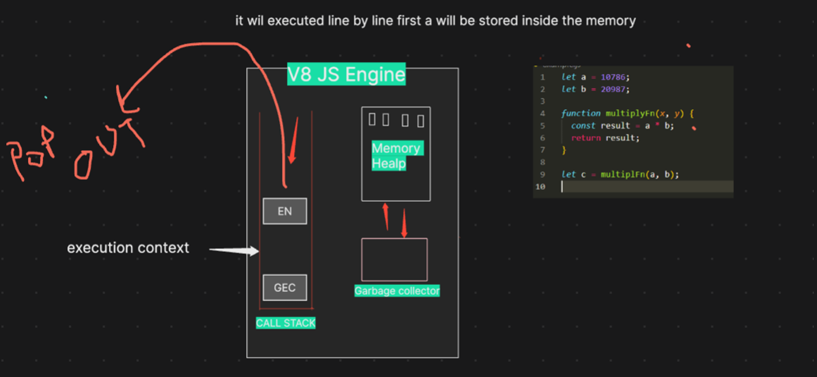

**Step 6: Resuming Global Execution Context**

Back in the global execution context, the returned value from `multiplyFn (226215682)` is assigned to the variable `c`
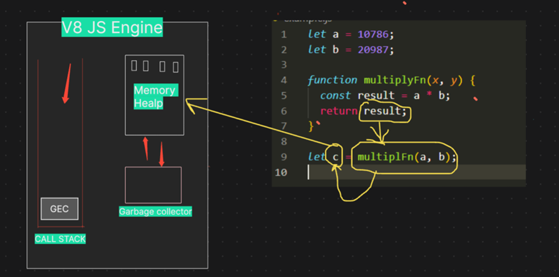

**Step 7: Once the entire code is executed, the global execution
context is also popped out, and the call stack becomes empty**


## How asynchronous code executed?

`The JavaScript engine cannot do this alone; it needs superpowers. This is where Node.js comes into the picture, giving it the ability to interact with operating system functionalities`

_The JS engine gains its superpowers from Node.js. Node.js grants these powers through a library named Libuv—our superhero._

`The JS engine cannot directly access OS files, so it calls on Libuv. Libuv, being very cool and full of superpowers, communicates with the OS, performs all the necessary tasks, and then returns the response to the JS engine. He offloads the work and does wonders behind the scene.`

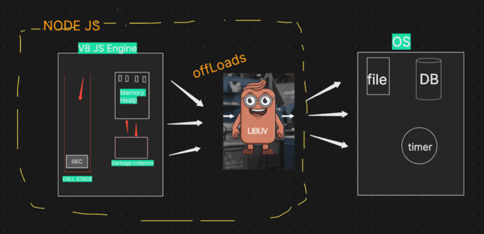

- The variables `let a` and `let b` are executed within the GEC (Global Execution Context) during the synchronous phase of the code execution process.
- However, when the code encounters an API call, the V8 engine, while still operating within the GEC, recognizes that it's dealing with an asynchronous operation. At this point, the V8 engine signals `libuv` — the superhero of Node.js to handle this API call.
- What happens next is that `libuv` registers this API call, including its associated callback function (name - A, within its event loop, allowing the V8 engine to continue executing the rest of the code without waiting for the API call to complete.

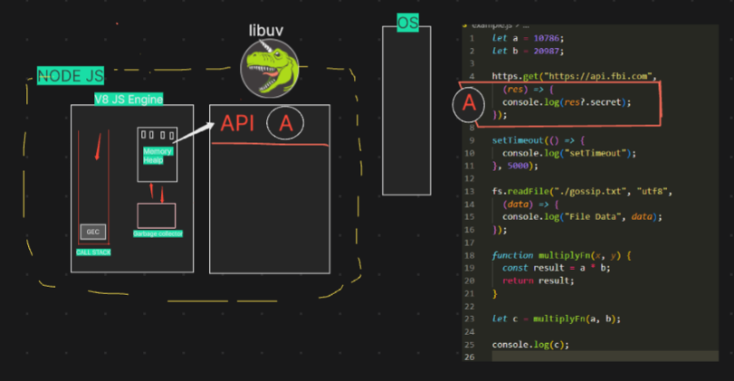

- Next, when the code encounters a `setTimeout` function, a similar process occurs
- The V8 engine identifies this as another asynchronous operation and once again notifies `libuv` .
  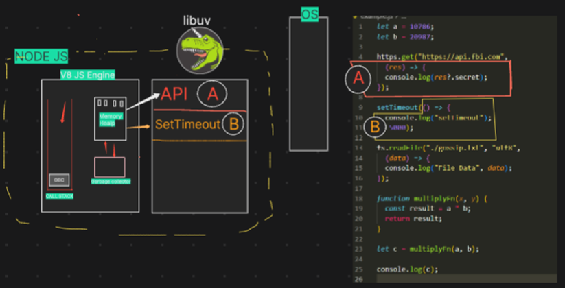
- Following this, when the code reaches a file operation (like reading or writing a file), the process is similar.
- The V8 engine recognizes this as another asynchronous task and alerts `libuv`.
- `libuv` then registers the file operation and its callback in the event loop
  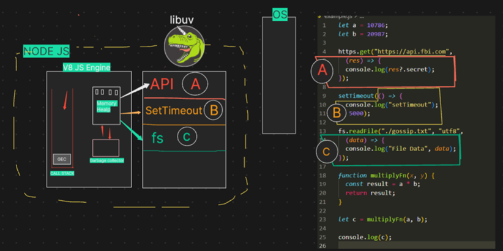

Next, when the code executes
`let c = multiplyFn(a, b);` , the JavaScript engine creates a new function context for `multiplyFn` and pushes it onto the call stack.

The function takes two parameters, `x` and `y`, and within the function, the engine multiplies these values (`a*b`)stores the result in the `result` variable.

The JavaScript engine handles this operation as part of the `synchronous code 
execution`

Next, when the code executes
`let c = multiplyFn(a, b);` , the JavaScript engine creates a new function context for `multiplyFn` and pushes it onto the call stack.

Once the
`multiplyFn` completes its execution and returns the result, the function context is popped off the call stack, and the result is assigned to the variable `c`

### Imp Concept:

- `When the function execution context is popped off the call stack, the garbage collector may clear any memory allocated for that context in the memory heap, if it is no longer needed`
- ` After console.log(c) is executed and the value of c is printed to the console, the global execution context will also eventually be removed from the call stack if the code execution is complete`
- `With the global context popped off the call stack, the JavaScript engine has finished processing, and the program ends.`
- `Now the call stack becomes empty, the JavaScript engine can relax, as there is no more code to execute.`
- `At this point, libuv takes over the major tasks. It handles operations such as processing timers, managing file system calls, and communicating with the operating system.`
- `libuv` performs these heavy tasks in the background, ensuring that
  asynchronous operations continue to be managed effectively.
  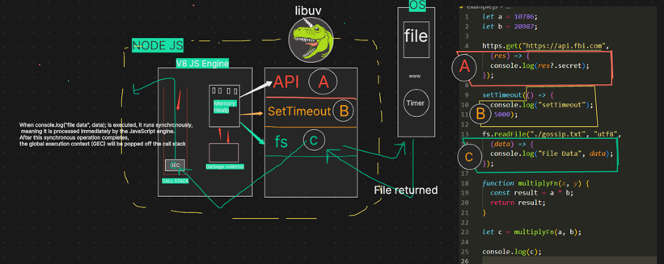

In summary, Node.js excels in handling asynchronous I/O operations, thanks to its
non-blocking I/O model.
